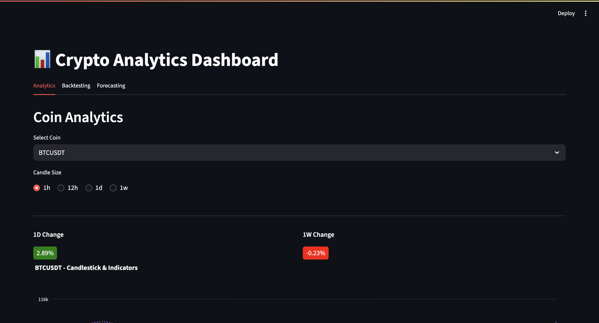
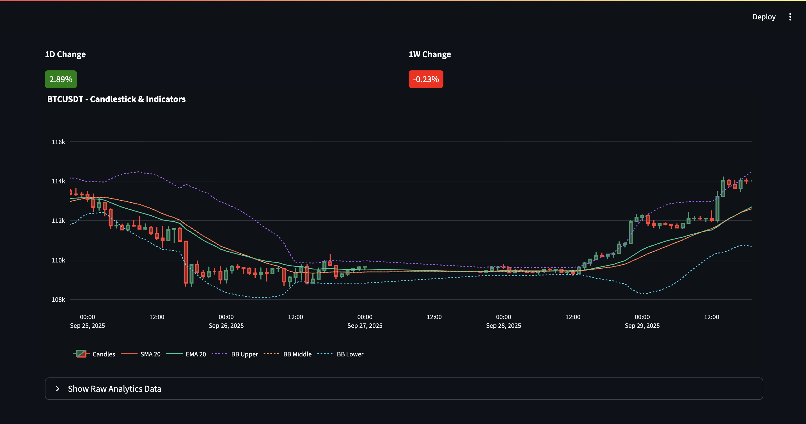
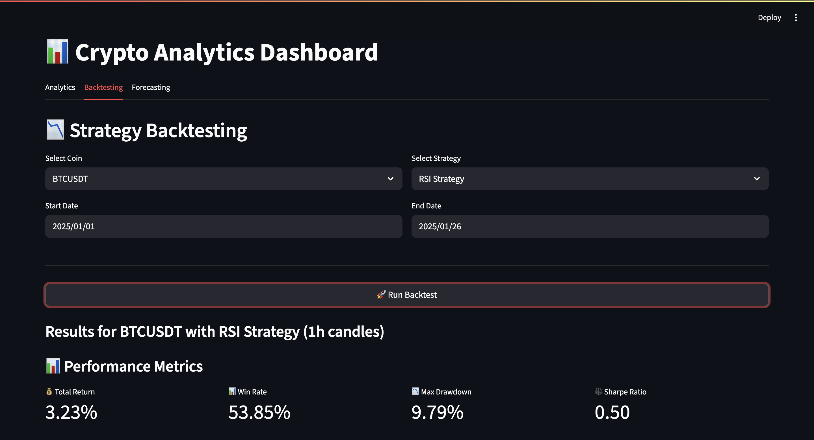
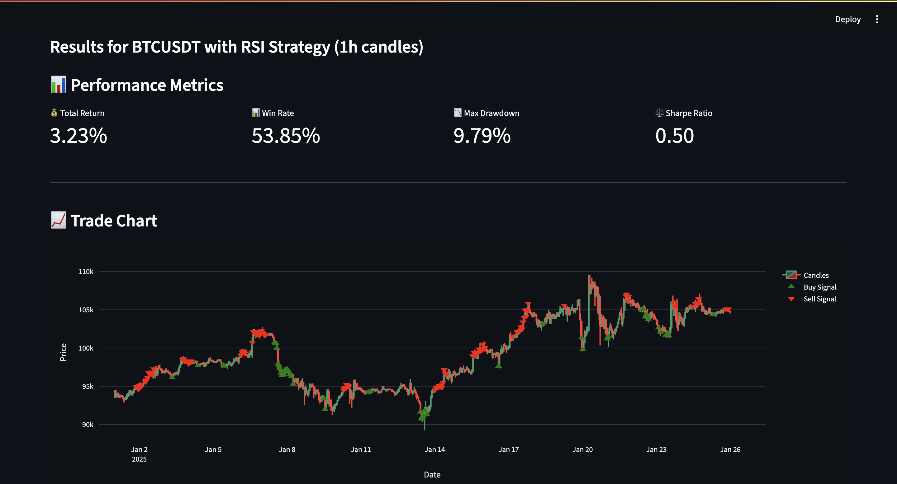
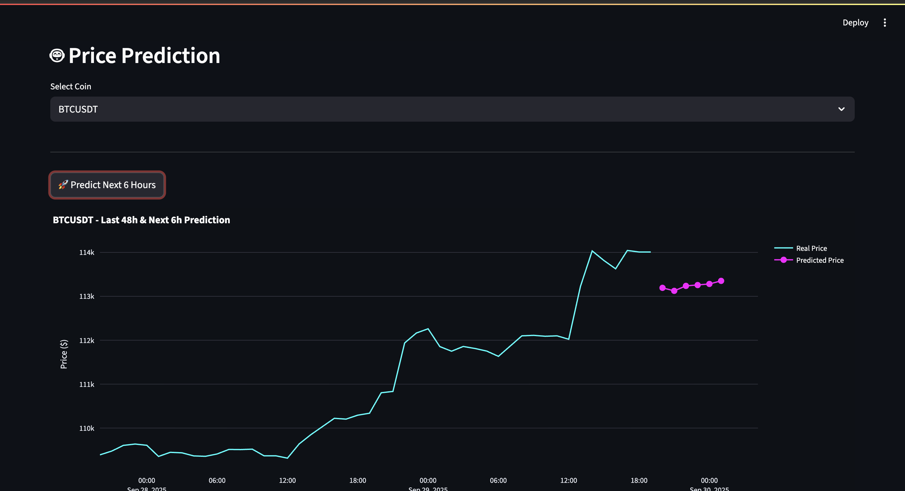
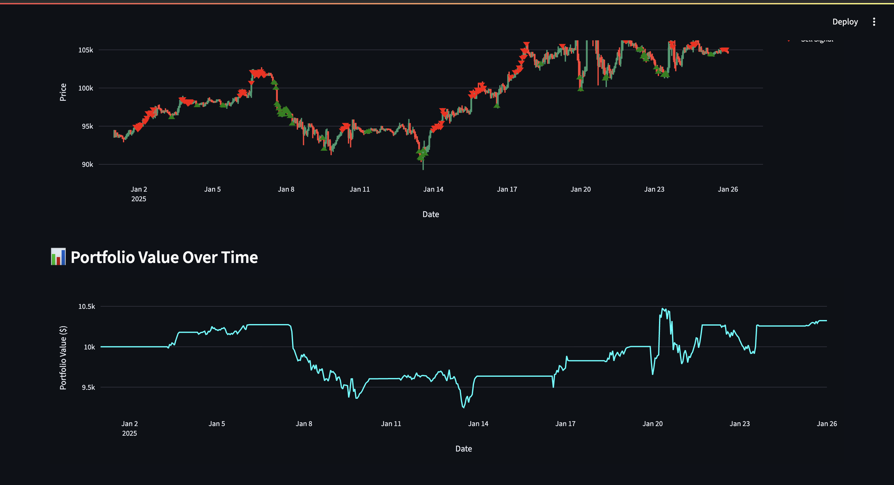

# Crypto Trading Bot & Backtesting Platform

This project is a full-stack application that provides a platform for backtesting cryptocurrency trading strategies and getting price predictions using a trained LSTM model. It features an automated ETL pipeline, a robust backend, and an interactive web-based frontend.

## 🚀 Features

- **Automated Data Ingestion:** An ETL pipeline, orchestrated with Apache Airflow, automatically fetches the latest cryptocurrency OHLCV (Open, High, Low, Close, Volume) data from Binance.
- **Strategy Backtesting:** An interactive interface to test various trading strategies over historical data and view performance metrics like total return, win rate, and max drawdown.
- **ML-Powered Predictions:** Utilizes a trained LSTM model to predict future cryptocurrency prices.
- **Interactive Frontend:** A web interface built with Streamlit provides data visualizations, backtesting controls, and prediction results.
- **RESTful Backend:** A robust backend built with FastAPI serves data to the frontend and runs the backtesting and prediction logic.
- **PostgreSQL Database:** A relational database for storing historical cryptocurrency data.

## 🛠️ Tech Stack

- **Backend:** Python, FastAPI
- **Frontend:** Streamlit, Plotly
- **Machine Learning:** TensorFlow (Keras), Scikit-learn
- **Data Pipeline (ETL):** Apache Airflow
- **Database:** PostgreSQL
- **Data Manipulation:** Pandas, NumPy

## 📂 Project Structure

```
final-bot/
├── backend/
│   ├── app/
│   │   ├── api/          # FastAPI endpoints
│   │   └── business/     # Business logic for services
│   ├── db/             # Database connection, schemas, and ETL scripts
│   ├── ml/             # Backtesting strategies and prediction models
│   └── models/         # Trained ML models and scalers
├── frontend/
│   └── app.py          # Main Streamlit application
├── airflow_dags/
│   └── crypto_etl_dag.py # Airflow DAG for data ingestion
├── .env.example        # Example environment variables file
├── requirements.txt    # Project dependencies
└── README.md
```

## ⚙️ Setup and Installation

Follow these steps to set up and run the project on your local machine.

### 1. Prerequisites

- Python 3.9+
- PostgreSQL
- Apache Airflow (optional, for running the ETL pipeline)

### 2. Clone the Repository

```bash
git clone <your-repository-url>
cd final-bot
```

### 3. Set Up the Environment

Create a virtual environment and install the required dependencies.

```bash
python -m venv .venv
source .venv/bin/activate  # On Windows, use `.venv\Scripts\activate`
pip install -r requirements.txt
```

### 4. Configure the Database

1.  **Create a PostgreSQL database** for the project (e.g., `crypto_db`).
2.  **Create a `.env` file** by copying the example file:
    ```bash
    cp .env.example .env
    ```
3.  **Edit the `.env` file** with your actual database credentials:
    ```
    DB_USER="your_db_user"
    DB_PASS="your_db_password"
    DB_HOST="localhost"
    DB_PORT="5432"
    DB_NAME="crypto_db"
    ```

### 5. Create the Database Table

Run the following script to create the `crypto_ohlcv` table in your database:

```bash
python backend/db/db_connection.py
```

### 6. Populate the Database

You can backfill the database with historical data by running:

```bash
python backend/db/db_backfill.py
```
This will fetch data from Binance and populate your database. This may take some time depending on the amount of data being fetched.

### 7. Train the ML Models

To train the LSTM models, run the following script:
```bash
python backend/lstm_multi_horizon_trainer.py
```
This will create the `models` directory and save the trained models and scalers there.

## ▶️ Running the Application

You need to run the backend and frontend servers in separate terminals.

### 1. Run the Backend Server

Navigate to the project root and run the following command:

```bash
uvicorn backend.app.main:app --reload
```
The backend server will be available at `http://127.0.0.1:8000`.

### 2. Run the Frontend Application

In a new terminal, run the Streamlit app:

```bash
streamlit run frontend/app.py
```
The frontend will be available at `http://localhost:8501`.

## 💨 Using the Application

- **Backtesting:** Open the web interface, select a coin and strategy, and run the backtest to see the results.
- **Predictions:** Use the prediction feature to get the next-hour price prediction for a selected coin.
- **ETL Pipeline:** If you have Airflow set up, you can place the `crypto_etl_dag.py` file in your Airflow DAGs folder to enable the automated data pipeline.

## 📸 Screenshots

### Dashboard



### Backtesting



### Forecast


